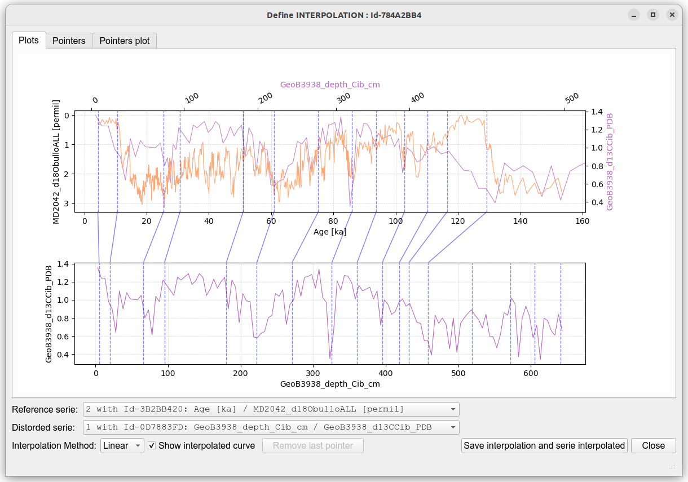

## PyAnalySeries

PyAnalySeries Reimagined: A Multi-Platform Revival of a Legacy Tool for Paleoclimate Time Series Analysis

**PyAnalySeries** is a Python application built on **matplotlib**, with a **PyQt-based graphical interface**, making it easily portable across platforms including **Linux**, **macOS**, and **Windows**.  
It is designed as a modern continuation of the <a href="https://github.com/PaleoIPSL/AnalySeries" target="_blank">**AnalySeries**</a>, the original application on MacOS, aiming to reproduce its core functionalities within a more robust and portable Python environment.  
Special attention has been given to **ergonomics**, emphasizing **simplicity** and **clarity**, while offering intuitive interactivity such as **zooming**, **panning**, and **scrolling**, with **linked or independent axes**.  
The core design follows a **"Define then Apply"** workflow for data processing operations such as **filtering**, **sampling**, and **interpolation**.  
Documents are read and saved in an **open format** spreadsheet (xlsx) with **multiple worksheets** for organization. It is also possible to import series or pointers directly from the **clipboard**, following a simple **copy (Ctrl+C)** operation from an external spreadsheet.  
The application leverages **robust, well-tested modules** for interpolation, notably **SciPy**, and features an **interactive interface** for defining **interpolation pointers** (formerly known as *Linage* and *Splinage*), allowing for **precise placement and manipulation**—either directly on data points or independently.  

Based on:
 * numpy
 * pandas
 * matplotlib
 * scipy
 * shapely
 * openpyxl
 * PyQt

Conception and developments : Patrick Brockmann LSCE/CEA - IPSL

This project is distributed under the **CeCILL v2.1** license.  

#### Installation

##### Get the application

 * `git clone https://github.com/PaleoIPSL/PyAnalySeries`
 * `cd PyAnalySeries`

##### Create a python environment to use PyAnalySeries 

 * `conda env create --file environment.yml`
 * `conda env list`
 * `conda activate env_PyAnalySeries`

##### Test

 * `python PyAnalySeries_v5.0.py`
 * `python PyAnalySeries_v5.0.py test/ws_ex_5.0.xlsx`
 * `python PyAnalySeries_v5.0.py test/MD95-2042.xlsx test/GeoB3938.xlsx`

##### Icon and shortcut 

 * Icon : 
 * Shortcut on Linux :
 	* Copy the PyAnalySeries.desktop file to your Desktop, and make change to specify YOURLOGIN
 	* Make change in the PyAnalySeries.sh file to specify the anaconda installtion directory
	* Set an icon on the shorcut by choosing the PyAnalySeries_icon.png file as icon

 * Shortcut on MacOS :
 	* Use Automator tool to set a shortcut (choose new and execute shell)
	* Set in the shell the PyAnalySeries.sh file content with correct anaconda path
	* Set an icon by pressing **⌘ + I** on the shorcut and drag the PyAnalySeries_icon.icns file as icon 

#### Captures

 

 

