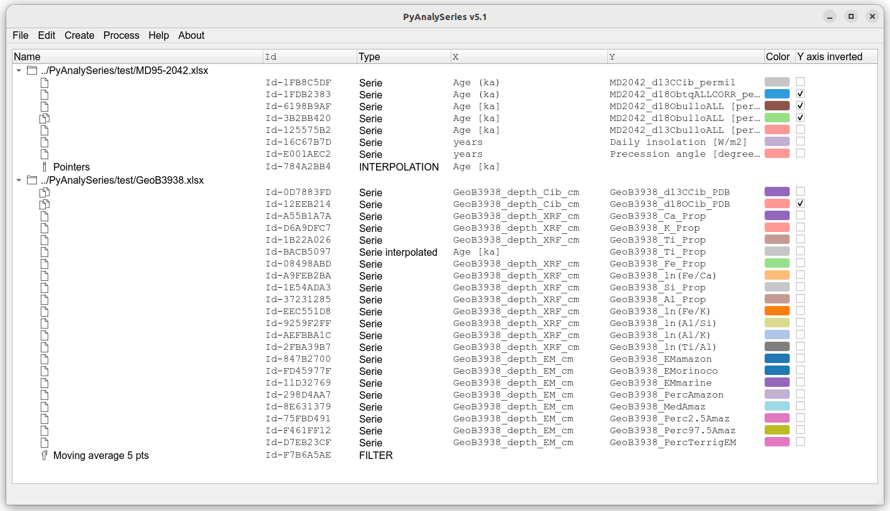

## PyAnalySeries

Python version for Analyseries

Based on:
 * numpy
 * pandas
 * matplotlib
 * scipy
 * openpyxl
 * PyQt

#### Installation

##### Get the application
 * `git clone https://github.com/PBrockmann/PyAnalySeries`
 * `cd PyAnalySeries`

##### Create a python environment to use PyAnalySeries 

 * `conda env create --file environment.yml`
 * `conda env list`
 * `conda activate env_PyAnalySeries`

##### Test
 * `python PyAnalySeries_v5.0.py`
 * `python PyAnalySeries_v5.0.py test/ws_ex_5.0.xlsx`

#### Captures

 

 
